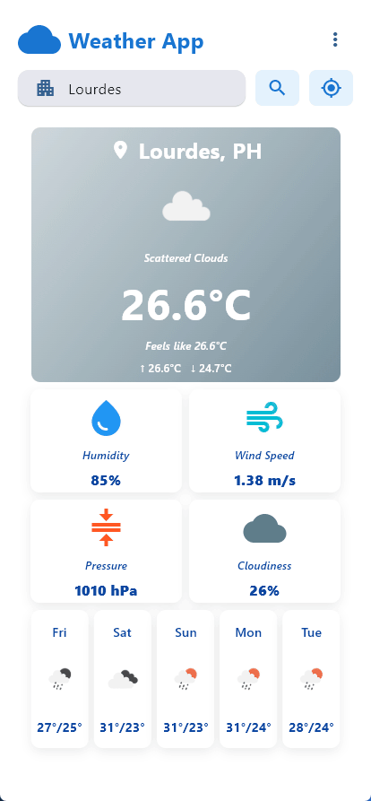
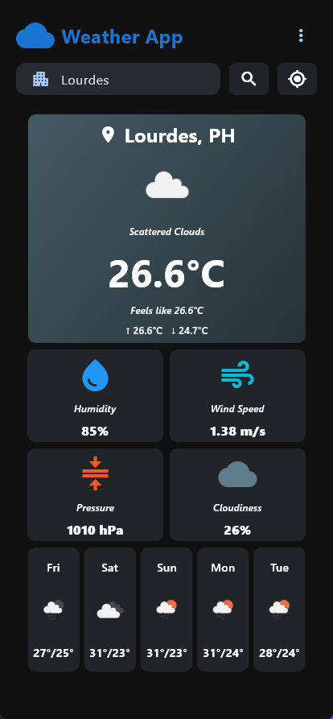
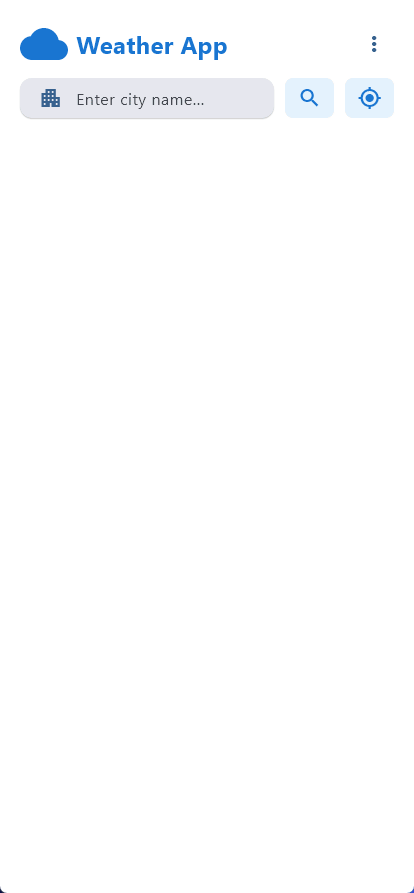

# Weather Application - Module 6 Lab

## Student Information

- **Name**: Mark Joseph Orias
- **Student ID**: 231002285
- **Course**: CCCS 106 - Application Development and Emerging Technologies
- **Section**: A

## Project Overview

A modern, cross-platform weather application built with Python and **Flet v0.28.3**. This project demonstrates system integration by connecting to the **OpenWeatherMap API** using **httpx** for asynchronous data fetching. The application features a responsive design that includes real-time weather data, persistent search history, dynamic theming based on weather conditions, and geolocation support.

## Features Implemented

### Base Features

- [x] City search functionality
- [x] Current weather display
- [x] Temperature, humidity, wind speed
- [x] Weather icons
- [x] Error handling
- [x] Modern UI with Material Design

### Enhanced Features

1. **Search History**

   - **Description:** The app stores the last 5-10 searched cities using local JSON file storage. It displays these in a dropdown/list for quick re-search access.
   - **Why you chose this feature:** To improve user experience by reducing repetitive typing for frequently checked locations.
   - **Challenges faced:** Understanding the `SearchBar` properties in Flet. The search view was initially too large, and making the height dynamically adjust to the number of search entries proved difficult. Ultimately, I implemented a fixed-size value to ensure stability.

2. **Temperature Unit Toggle**

   - **Description:** A switch allows users to toggle between Celsius and Fahrenheit. The app instantly recalculates and redisplays all temperature data (current and forecast) without needing to re-fetch data from the API.
   - **Why you chose this feature:** To make the application accessible to users accustomed to different measurement systems.
   - **Challenges faced:** Ensuring that every temperature value updates immediately when the button is toggled. The main difficulty was synchronizing the state updates smoothly across all different UI components simultaneously.

3. **Weather Condition Icons and Colors Gradients**

   - **Description:** The application changes its background gradient colors based on the weather condition (e.g., Yellow for Sunny, Blue/Grey for Rain). It also implements custom icons and animations.
   - **Why you chose this feature:** To provide immediate visual feedback and improve the aesthetic appeal of the interface.
   - **Challenges faced:** Mapping the API weather codes to specific color palettes and ensuring the background gradients transitioned smoothly between states.

4. **Current Location Weather (GPS & IP)**

   - **Description:** Uses IP-based geolocation to detect the user's city on startup and includes a "My Location" button to fetch weather for specific GPS coordinates.
   - **Why you chose this feature:** To allow users to get instant weather updates for their immediate surroundings without typing.
   - **Challenges faced:** Handling permission requests and managing fallback logic when GPS data is unavailable. Additionally, ensuring cross-platform compatibility (Web, Windows, iOS, Android) required extensive testing.

5. **5-Day Weather Forecast**
   - **Description:** A distinct view showing the forecast for the next 5 days, including daily high/low temperatures and aggregated weather conditions.
   - **Why you chose this feature:** To provide more value than just current weather, allowing users to plan ahead.
   - **Challenges faced:** resolving data retrieval errors from the API. Specifically, the daily high and low temperatures were occasionally displaying incorrect or identical values (e.g., "25° / 25°").

## Screenshots

[**Figma Wireframe**](https://www.figma.com/design/MMjzMPVc14L3PwDXDYobGE/Wireframe?node-id=2177-111)

|                   Dark Mode                    |                   Light Mode Search                    |
| :--------------------------------------------: | :----------------------------------------------------: |
|  |  |

|                          Unit Toggle                           |                  Geolocation Support                   |
| :------------------------------------------------------------: | :----------------------------------------------------: |
|  |  |

|                  Desktop View                   |                 Error Handling                  |
| :---------------------------------------------: | :---------------------------------------------: |
|  |  |

## Installation

### Prerequisites

- Python 3.8 or higher
- pip package manager
- OpenWeatherMap API Key

### Setup Instructions

```bash
# Clone the repository
git clone https://github.com/markjorias/cccs106-projects.git
cd cccs106-projects/mod6_labs

# Create virtual environment
python -m venv venv
source venv/bin/activate  # On Windows: venv\Scripts\activate

# Install dependencies
pip install -r requirements.txt

# Create .env file
cp .env.example .env
# Add your OpenWeatherMap API key to .env
```
