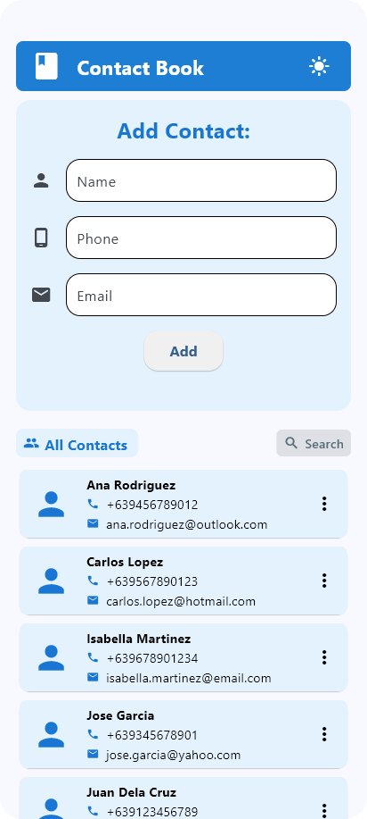
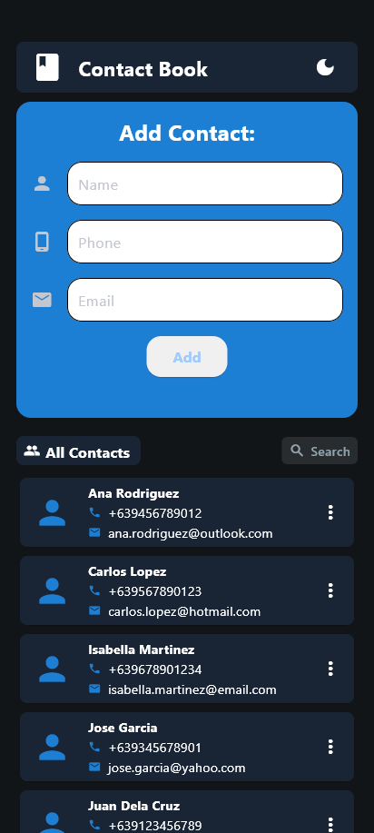
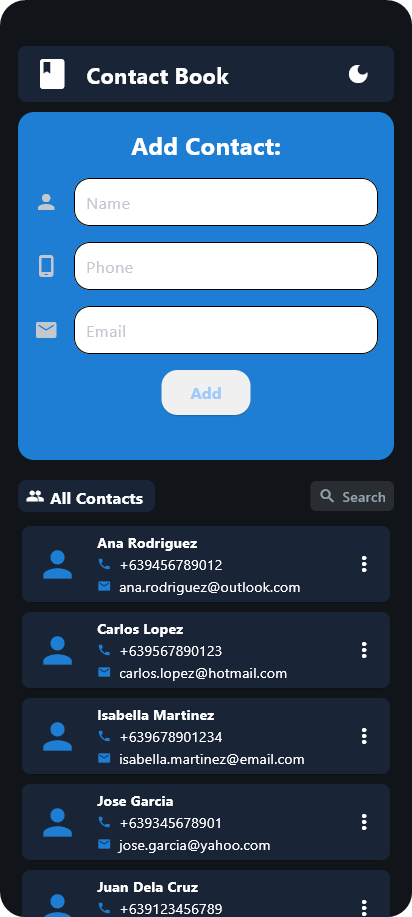

<!-- Insert app screenshot here -->

# 📱 Contact Book App

<div align="center" style="display: flex; justify-content: center; align-items: center; gap: 10px;">
  
  
  
</div>

## ✅ Project Status: **COMPLETE**

A simple, cross-platform contact management application built with Python and Flet framework for CCCS 106 course activity. This application demonstrates basic CRUD operations, database management, and GUI development concepts learned in the course.

## 🚀 Features

### Core Functionality

- **Add Contacts**: Create new contacts with name, phone number, and email
- **View Contacts**: Display all contacts in a modern card-based layout
- **Edit Contacts**: Update existing contact information through an intuitive dialog
- **Delete Contacts**: Remove contacts with confirmation dialog
- **Search Contacts**: Real-time search functionality to find contacts by name

### User Experience

- **Responsive Design**: Optimized for mobile and desktop viewing
- **Dark/Light Theme**: Toggle between dark and light themes with persistent settings
- **Input Validation**: Comprehensive validation for all contact fields
- **Error Handling**: User-friendly error messages and validation feedback
- **Modern UI**: Clean, card-based interface with Material Design principles

### Technical Features

- **SQLite Database**: Local data persistence with automatic database initialization
- **Cross-Platform**: Runs on Windows, macOS, Linux, Android, and iOS
- **Phone Number Formatting**: Automatic formatting for Philippine phone numbers (+63)
- **Email Validation**: Built-in email format validation
- **Alphabetical Sorting**: Contacts automatically sorted alphabetically by name

<div align="center">
  
</div>

## 🛠️ Technology Stack

- **Framework**: Flet 0.28.3
- **Language**: Python 3.9+
- **Database**: SQLite3
- **UI Components**: Material Design-inspired components
- **Platform Support**: Desktop (Windows, macOS, Linux), Mobile (Android, iOS), Web

## 📋 Requirements

- Python 3.9 or higher
- Flet framework
- SQLite3 (included with Python)

## 🚀 Installation & Setup

### Using uv (Recommended)

1. Clone the repository:

```bash
git clone <repository-url>
cd contact_book_app
```

2. Install dependencies:

```bash
uv sync
```

3. Run the application:

```bash
# Desktop app
uv run flet run

# Web app
uv run flet run --web
```

### Using Poetry

1. Install dependencies:

```bash
poetry install
```

2. Run the application:

```bash
# Desktop app
poetry run flet run

# Web app
poetry run flet run --web
```

### Using pip

1. Install Flet:

```bash
pip install flet
```

2. Run the application:

```bash
python src/main.py
```

## 📱 Building for Mobile/Desktop

### Android APK

```bash
flet build apk -v
```

### iOS App

```bash
flet build ipa -v
```

### macOS App

```bash
flet build macos -v
```

### Windows App

```bash
flet build windows -v
```

### Linux App

```bash
flet build linux -v
```

## 🎯 Key Features in Detail

### Contact Management

- **Add Contact**: Fill in name, phone, and email with real-time validation
- **Edit Contact**: Click the menu button on any contact to edit details
- **Delete Contact**: Remove contacts with a confirmation dialog
- **Search**: Type in the search box to filter contacts by name

### Input Validation

- **Name**: Letters, spaces, hyphens, and apostrophes only
- **Phone**: 10-digit Philippine mobile numbers starting with 9
- **Email**: Standard email format validation

### Theme Support

- **Dark Mode**: Modern dark theme with blue accents
- **Light Mode**: Clean light theme with blue highlights
- **Toggle**: Easy theme switching via the app bar button

## 🔧 Development

The application is built with a modular architecture:

- **`main.py`**: Application entry point and UI layout
- **`app_logic.py`**: Business logic, validation, and event handlers
- **`database.py`**: Database operations and SQLite management

---

**Status**: ✅ Complete and fully functional
**Last Updated**: January 2025
**Framework**: Flet 0.28.3
**Python Version**: 3.9+
